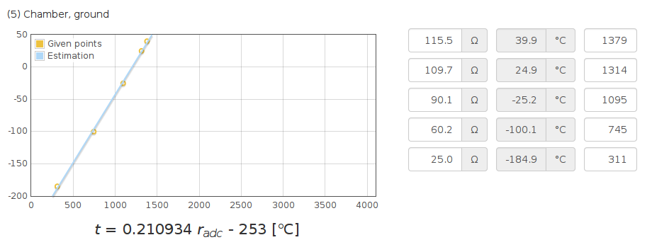
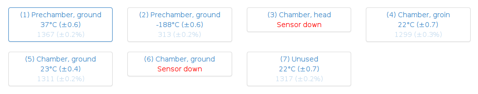

Pt100 Calibration
-----------------

Graphical frontend used to calibration of analog digital converters in
STM32 SoC's. The same procedue can be performed with an Excel spreadsheet.

Provides full functionality when device exposes some data on http route,
but it isn't required.

Usage
-----

* clone

    bower install
    make client-once
    make

* visit localhost:4444

Fill in the table containing (resistance, adc reading) touples.

There are some resistance values suggested which can be easily overriden.

Force different resistances at input and type here readings from your ADC.
Data will be plotted and proper equation calculated.

Feedback route on http
----------------------

Working */adc* route allows communication with the device

    curl 192.168.3.3/adc
    {"raw": [1349, ...], "translated": [36, ...]}

where 192.168.3.3 is the default device IP address. It can be changed
inside options.coffee.

Without it you can still use the tool but will have to read ADC values
by other way.
